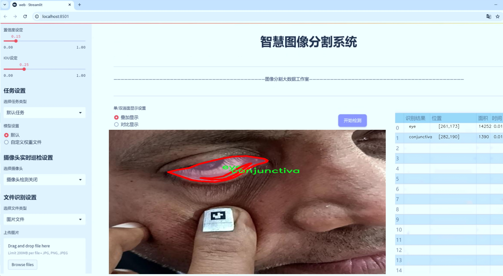
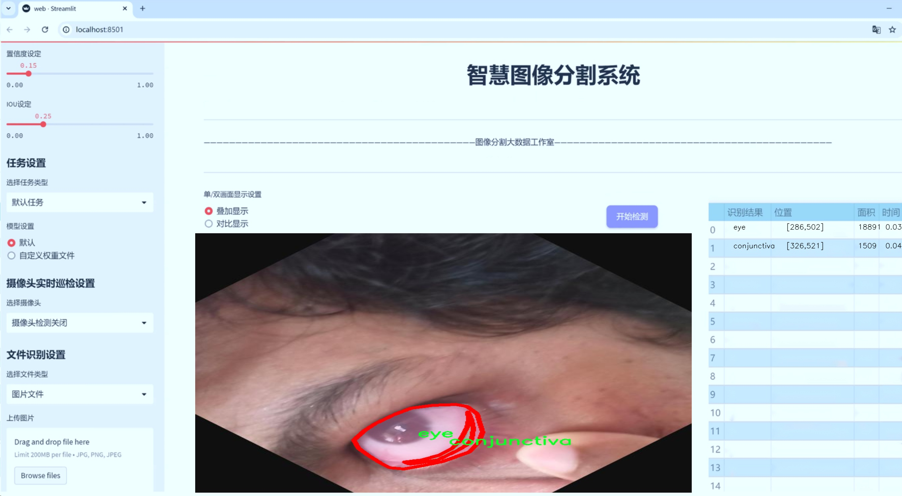
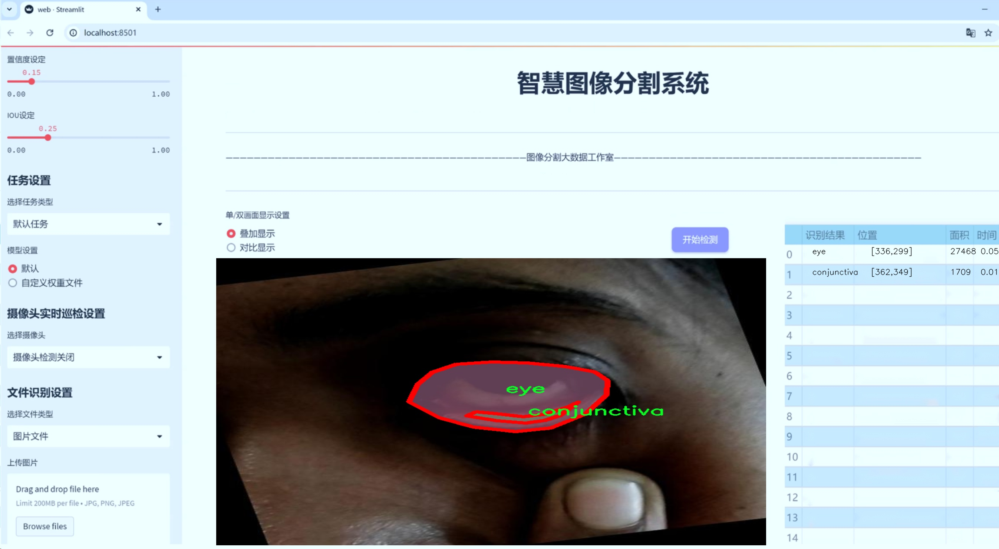
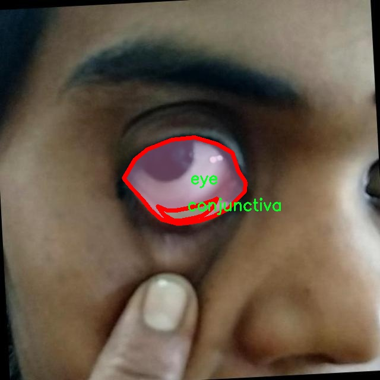
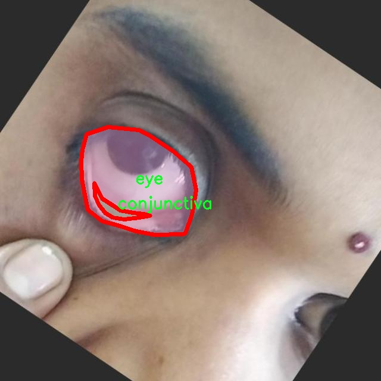
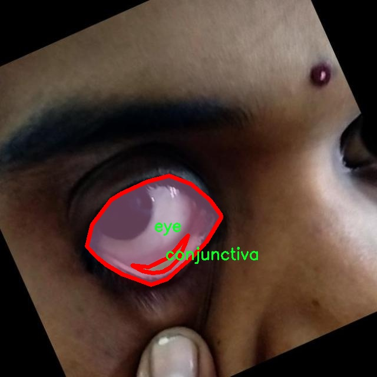
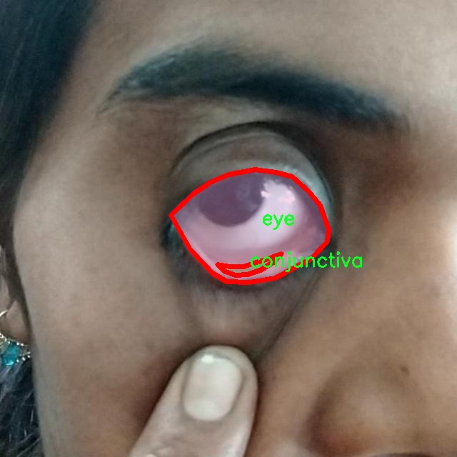
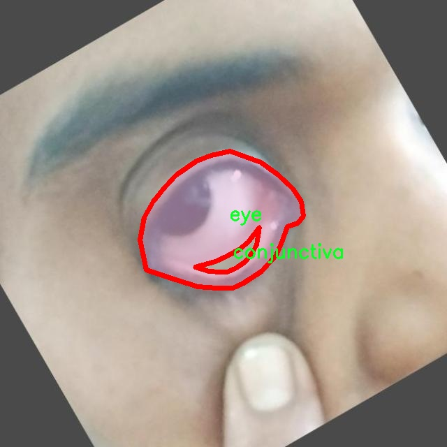

# 眼结膜分割系统： yolov8-seg-C2f-ODConv

### 1.研究背景与意义

[参考博客](https://gitee.com/YOLOv8_YOLOv11_Segmentation_Studio/projects)

[博客来源](https://kdocs.cn/l/cszuIiCKVNis)

研究背景与意义

眼结膜作为眼睛的重要组成部分，承担着保护眼球、保持眼球湿润及提供免疫防御等多重功能。眼结膜的健康状况直接影响到视觉系统的正常运作，因此，眼结膜的疾病诊断与治疗在眼科医学中占据着重要地位。近年来，随着计算机视觉技术的快速发展，基于深度学习的图像分割方法在医学影像分析中展现出了巨大的潜力。尤其是YOLO（You Only Look Once）系列模型，因其高效的实时处理能力和优越的检测精度，逐渐成为眼科图像分析领域的研究热点。

本研究旨在基于改进的YOLOv8模型，构建一个高效的眼结膜分割系统。该系统将利用8900张包含眼结膜和眼睛的图像数据集进行训练与验证。数据集中包含两个主要类别：结膜（conjunctiva）和眼睛（eye），为模型的训练提供了丰富的样本基础。通过对这些图像的深度学习处理，能够实现对眼结膜的精准分割，从而为后续的疾病诊断提供有力支持。

在医学影像分析中，准确的图像分割是实现疾病识别和评估的前提。传统的手工分割方法不仅耗时耗力，而且受限于医生的主观判断，容易导致分割结果的不一致性。相比之下，基于YOLOv8的自动化分割系统能够在短时间内处理大量图像，并提供高精度的分割结果。这一技术的应用，不仅能够提高眼结膜疾病的诊断效率，还能为临床医生提供更为客观的数据支持，进而改善患者的治疗效果。

此外，眼结膜的病变常常与多种眼科疾病相关，如干眼症、结膜炎等。通过对眼结膜的精确分割，研究人员可以更深入地分析不同病变对眼结膜形态的影响，从而为相关疾病的研究提供新的视角和数据支持。这不仅有助于提升眼科医学的研究水平，也为未来的临床应用提供了坚实的基础。

本研究的意义还在于推动深度学习技术在医学影像领域的应用。随着人工智能技术的不断进步，基于深度学习的图像处理方法在各个领域都展现出了良好的应用前景。通过对YOLOv8模型的改进与优化，能够为医学影像分析提供更为高效的解决方案，同时也为相关领域的研究者提供了新的思路与方法。

综上所述，基于改进YOLOv8的眼结膜分割系统的研究，不仅具有重要的学术价值，还具备广泛的临床应用前景。通过这一研究，期望能够为眼科疾病的早期诊断与治疗提供有力支持，推动眼科医学的发展，并为其他医学影像分析领域的研究提供借鉴与参考。

### 2.图片演示







注意：本项目提供完整的训练源码数据集和训练教程,由于此博客编辑较早,暂不提供权重文件（best.pt）,需要按照6.训练教程进行训练后实现上图效果。

### 3.视频演示

[3.1 视频演示](https://www.bilibili.com/video/BV1YvzFY4EFo/)

### 4.数据集信息

##### 4.1 数据集类别数＆类别名

nc: 2
names: ['conjunctiva', 'eye']


##### 4.2 数据集信息简介

数据集信息展示

在本研究中，我们采用了名为“hehe”的数据集，以支持对YOLOv8-seg模型的改进，旨在实现高效的眼结膜分割系统。该数据集专注于眼部结构的精确识别与分割，尤其是眼结膜的特征提取，具有重要的临床应用价值。数据集的类别数量为2，具体类别包括“conjunctiva”（结膜）和“eye”（眼睛），这两个类别的选择为模型的训练提供了明确的目标，使得分割任务的实现更加清晰和高效。

“hehe”数据集的构建过程经过精心设计，确保了数据的多样性和代表性。数据集中包含了大量的眼部图像，这些图像在不同的光照条件、视角和背景下进行采集，涵盖了各种眼部状态。这种多样性不仅增强了模型的泛化能力，还提高了其在实际应用中的可靠性。每一张图像都经过专业的标注，确保了结膜和眼睛区域的准确定位，为模型的训练提供了高质量的标签数据。

在数据集的标注过程中，采用了先进的图像处理技术，确保每个类别的边界清晰可辨。结膜的边缘与眼睛的界限被精确地描绘出来，这对于后续的分割任务至关重要。通过这种精细的标注，YOLOv8-seg模型能够在训练过程中学习到结膜与眼睛之间的微妙差异，从而在实际应用中实现更高的分割精度。

此外，数据集还考虑到了不同人群的眼部特征差异，包含了来自不同年龄、性别和种族的样本。这种多样性使得模型在面对不同个体时，能够保持良好的性能，减少了因样本偏差导致的误判风险。通过在“hehe”数据集上进行训练，YOLOv8-seg模型将能够更好地适应临床环境中的复杂情况，为眼科医生提供更为精准的辅助诊断工具。

为了进一步提升模型的性能，我们还计划在数据集上进行数据增强处理，包括旋转、缩放、翻转等操作。这些增强技术将帮助模型在训练过程中接触到更多的变换形式，从而提高其鲁棒性和适应性。经过这些处理后，数据集的有效样本数量将显著增加，为模型提供更为丰富的学习材料。

总之，“hehe”数据集为改进YOLOv8-seg的眼结膜分割系统提供了坚实的基础。通过精确的标注、多样的样本和合理的数据增强策略，该数据集不仅能够有效支持模型的训练，还为未来在眼科领域的应用奠定了良好的基础。随着研究的深入，我们期待该系统能够在实际临床中发挥重要作用，助力眼科诊断的智能化和精准化。











### 5.项目依赖环境部署教程（零基础手把手教学）

[5.1 环境部署教程链接（零基础手把手教学）](https://www.bilibili.com/video/BV1jG4Ve4E9t/?vd_source=bc9aec86d164b67a7004b996143742dc)


[5.2 安装Python虚拟环境创建和依赖库安装视频教程链接（零基础手把手教学）](https://www.bilibili.com/video/BV1nA4VeYEze/?vd_source=bc9aec86d164b67a7004b996143742dc)

### 6.手把手YOLOV8-seg训练视频教程（零基础手把手教学）

[6.1 手把手YOLOV8-seg训练视频教程（零基础小白有手就能学会）](https://www.bilibili.com/video/BV1cA4VeYETe/?vd_source=bc9aec86d164b67a7004b996143742dc)


按照上面的训练视频教程链接加载项目提供的数据集，运行train.py即可开始训练



     Epoch   gpu_mem       box       obj       cls    labels  img_size
     1/200     0G   0.01576   0.01955  0.007536        22      1280: 100%|██████████| 849/849 [14:42<00:00,  1.04s/it]
               Class     Images     Labels          P          R     mAP@.5 mAP@.5:.95: 100%|██████████| 213/213 [01:14<00:00,  2.87it/s]
                 all       3395      17314      0.994      0.957      0.0957      0.0843

     Epoch   gpu_mem       box       obj       cls    labels  img_size
     2/200     0G   0.01578   0.01923  0.007006        22      1280: 100%|██████████| 849/849 [14:44<00:00,  1.04s/it]
               Class     Images     Labels          P          R     mAP@.5 mAP@.5:.95: 100%|██████████| 213/213 [01:12<00:00,  2.95it/s]
                 all       3395      17314      0.996      0.956      0.0957      0.0845

     Epoch   gpu_mem       box       obj       cls    labels  img_size
     3/200     0G   0.01561    0.0191  0.006895        27      1280: 100%|██████████| 849/849 [10:56<00:00,  1.29it/s]
               Class     Images     Labels          P          R     mAP@.5 mAP@.5:.95: 100%|███████   | 187/213 [00:52<00:00,  4.04it/s]
                 all       3395      17314      0.996      0.957      0.0957      0.0845


### 7.50+种全套YOLOV8-seg创新点加载调参实验视频教程（一键加载写好的改进模型的配置文件）

[7.1 50+种全套YOLOV8-seg创新点加载调参实验视频教程（一键加载写好的改进模型的配置文件）](https://www.bilibili.com/video/BV1Hw4VePEXv/?vd_source=bc9aec86d164b67a7004b996143742dc)

### YOLOV8-seg算法简介

原始YOLOv8-seg算法原理

YOLOv8-seg算法是YOLO系列目标检测模型的最新版本，结合了目标检测与语义分割的能力，旨在提供更为精确和高效的图像理解。该算法在YOLOv8的基础上进行了扩展，特别是针对分割任务的需求，增强了网络的特征提取和处理能力。YOLOv8-seg的设计理念是通过单阶段检测框架实现高效的目标检测和分割，保持了YOLO系列一贯的速度优势，同时在精度上也有显著提升。

YOLOv8-seg的网络结构主要由输入层、主干网络、颈部网络和头部网络四个部分组成。输入层负责对输入图像进行预处理，包括图像缩放、马赛克增强和自适应锚框计算等操作。这些预处理步骤旨在提高模型对不同场景和目标的适应能力，确保在各种条件下都能有效地提取特征。特别是马赛克增强技术，它通过对图像进行随机裁剪和拼接，增加了训练数据的多样性，从而提升了模型的泛化能力。

在主干网络部分，YOLOv8-seg采用了C2f模块，这一模块的设计灵感来源于YOLOv7的E-ELAN结构，通过引入更多的跨层连接，增强了梯度流动，进而提升了特征表示能力。C2f模块的引入使得网络能够更好地捕捉到图像中的细节信息，尤其是在处理复杂场景时，能够有效避免信息的丢失。此外，YOLOv8-seg还引入了SPPF（Spatial Pyramid Pooling Fusion）模块，通过多尺度池化操作，进一步增强了特征图的表达能力，使得网络能够处理不同尺度的目标，提升了对小目标的检测能力。

颈部网络则采用了路径聚合网络（PAN）结构，这一结构的设计旨在加强不同尺度特征的融合能力。通过特征金字塔和路径聚合的结合，YOLOv8-seg能够有效地整合来自主干网络的多层特征，确保语义信息和定位信息的有效传递。这种特征融合策略使得网络在面对复杂背景和多目标场景时，能够保持较高的检测精度和分割效果。

在头部网络部分，YOLOv8-seg采用了解耦的检测头结构，将分类和回归任务分开处理。这一设计不仅加速了模型的收敛速度，还提高了目标检测和分割的精度。具体而言，分类分支采用了二元交叉熵损失（BCELoss），而回归分支则结合了分布焦点损失（DFLoss）和完全交并比损失（CIOULoss），以优化边界框的预测效果。通过这种方式，YOLOv8-seg能够在保持高效性的同时，显著提升对目标的检测和分割精度。

值得一提的是，YOLOv8-seg在处理分割任务时，利用了像素级的特征信息，通过引入分割头，进一步增强了对目标轮廓的识别能力。这一创新使得YOLOv8-seg不仅能够检测目标的位置，还能够精确地分割出目标的形状，为后续的图像分析和理解提供了更为丰富的信息。

在实际应用中，YOLOv8-seg的高效性和准确性使其在自动驾驶、智能监控、医学影像分析等领域展现出广泛的应用前景。其快速的推理速度和较低的计算资源需求，使得YOLOv8-seg成为实时应用的理想选择。此外，YOLOv8-seg的灵活性也体现在其可根据不同的应用场景进行模型的调整和优化，用户可以根据具体需求选择不同规模的模型，从而在精度和速度之间找到最佳平衡。

综上所述，YOLOv8-seg算法通过对YOLOv8的结构优化和功能扩展，实现了目标检测与语义分割的有机结合。其独特的网络设计和高效的特征处理能力，使得YOLOv8-seg在图像理解任务中展现出卓越的性能，成为当前计算机视觉领域的一项重要进展。随着研究的深入和技术的不断演进，YOLOv8-seg有望在更多实际应用中发挥更大的作用，为推动智能视觉技术的发展贡献力量。


### 9.系统功能展示（检测对象为举例，实际内容以本项目数据集为准）

图9.1.系统支持检测结果表格显示

  图9.2.系统支持置信度和IOU阈值手动调节

  图9.3.系统支持自定义加载权重文件best.pt(需要你通过步骤5中训练获得)

  图9.4.系统支持摄像头实时识别

  图9.5.系统支持图片识别

  图9.6.系统支持视频识别

  图9.7.系统支持识别结果文件自动保存

  图9.8.系统支持Excel导出检测结果数据


### 10.50+种全套YOLOV8-seg创新点原理讲解（非科班也可以轻松写刊发刊，V11版本正在科研待更新）

#### 10.1 由于篇幅限制，每个创新点的具体原理讲解就不一一展开，具体见下列网址中的创新点对应子项目的技术原理博客网址【Blog】：


[10.1 50+种全套YOLOV8-seg创新点原理讲解链接](https://gitee.com/qunmasj/good)

#### 10.2 部分改进模块原理讲解(完整的改进原理见上图和技术博客链接)【如果此小节的图加载失败可以通过CSDN或者Github搜索该博客的标题访问原始博客，原始博客图片显示正常】

### Gold-YOLO简介
YOLO再升级：华为诺亚提出Gold-YOLO，聚集-分发机制打造新SOTA
在过去的几年中，YOLO系列模型已经成为实时目标检测领域的领先方法。许多研究通过修改架构、增加数据和设计新的损失函数，将基线推向了更高的水平。然而以前的模型仍然存在信息融合问题，尽管特征金字塔网络（FPN）和路径聚合网络（PANet）已经在一定程度上缓解了这个问题。因此，本研究提出了一种先进的聚集和分发机制（GD机制），该机制通过卷积和自注意力操作实现。这种新设计的模型被称为Gold-YOLO，它提升了多尺度特征融合能力，在所有模型尺度上实现了延迟和准确性的理想平衡。此外，本文首次在YOLO系列中实现了MAE风格的预训练，使得YOLO系列模型能够从无监督预训练中受益。Gold-YOLO-N在COCO val2017数据集上实现了出色的39.9% AP，并在T4 GPU上实现了1030 FPS，超过了之前的SOTA模型YOLOv6-3.0-N，其FPS相似，但性能提升了2.4%。


#### Gold-YOLO


YOLO系列的中间层结构采用了传统的FPN结构，其中包含多个分支用于多尺度特征融合。然而，它只充分融合来自相邻级别的特征，对于其他层次的信息只能间接地进行“递归”获取。

传统的FPN结构在信息传输过程中存在丢失大量信息的问题。这是因为层之间的信息交互仅限于中间层选择的信息，未被选择的信息在传输过程中被丢弃。这种情况导致某个Level的信息只能充分辅助相邻层，而对其他全局层的帮助较弱。因此，整体上信息融合的有效性可能受到限制。
为了避免在传输过程中丢失信息，本文采用了一种新颖的“聚集和分发”机制（GD），放弃了原始的递归方法。该机制使用一个统一的模块来收集和融合所有Level的信息，并将其分发到不同的Level。通过这种方式，作者不仅避免了传统FPN结构固有的信息丢失问题，还增强了中间层的部分信息融合能力，而且并没有显著增加延迟。


# 8.低阶聚合和分发分支 Low-stage gather-and-distribute branch
从主干网络中选择输出的B2、B3、B4、B5特征进行融合，以获取保留小目标信息的高分辨率特征。


低阶特征对齐模块 (Low-stage feature alignment module)： 在低阶特征对齐模块（Low-FAM）中，采用平均池化（AvgPool）操作对输入特征进行下采样，以实现统一的大小。通过将特征调整为组中最小的特征大小（ R B 4 = 1 / 4 R ） （R_{B4} = 1/4R）（R 
B4 =1/4R），我们得到对齐后的特征F a l i g n F_{align}F align 。低阶特征对齐技术确保了信息的高效聚合，同时通过变换器模块来最小化后续处理的计算复杂性。其中选择 R B 4 R_{B4}R B4 作为特征对齐的目标大小主要基于保留更多的低层信息的同时不会带来较大的计算延迟。
低阶信息融合模块(Low-stage information fusion module)： 低阶信息融合模块（Low-IFM）设计包括多层重新参数化卷积块（RepBlock）和分裂操作。具体而言，RepBlock以F a l i g n ( c h a n n e l = s u m ( C B 2 ， C B 3 ， C B 4 ， C B 5 ) ) F_{align} (channel= sum(C_{B2}，C_{B3}，C_{B4}，C_{B5}))F align (channel=sum(C B2 ，C B3 ，C B4 ，C B5 )作为输入，并生成F f u s e ( c h a n n e l = C B 4 + C B 5 ) F_{fuse} (channel= C_{B4} + C_{B5})F fuse (channel=C B4 +C B5 )。其中中间通道是一个可调整的值（例如256），以适应不同的模型大小。由RepBlock生成的特征随后在通道维度上分裂为F i n j P 3 Finj_P3Finj P 3和F i n j P 4 Finj_P4Finj P 4，然后与不同级别的特征进行融合。


# 8.高阶聚合和分发分支 High-stage gather-and-distribute branch
高级全局特征对齐模块（High-GD）将由低级全局特征对齐模块（Low-GD）生成的特征{P3, P4, P5}进行融合。


高级特征对齐模块(High-stage feature alignment module)： High-FAM由avgpool组成，用于将输入特征的维度减小到统一的尺寸。具体而言，当输入特征的尺寸为{R P 3 R_{P3}R P3 , R P 4 R_{P4}R P4 , R P 5 R_{P 5}R P5 }时，avgpool将特征尺寸减小到该特征组中最小的尺寸（R P 5 R_{P5}R P5  = 1/8R）。由于transformer模块提取了高层次的信息，池化操作有助于信息聚合，同时降低了transformer模块后续步骤的计算需求。

Transformer融合模块由多个堆叠的transformer组成，transformer块的数量为L。每个transformer块包括一个多头注意力块、一个前馈网络（FFN）和残差连接。采用与LeViT相同的设置来配置多头注意力块，使用16个通道作为键K和查询Q的头维度，32个通道作为值V的头维度。为了加速推理过程，将层归一化操作替换为批归一化，并将所有的GELU激活函数替换为ReLU。为了增强变换器块的局部连接，在两个1x1卷积层之间添加了一个深度卷积层。同时，将FFN的扩展因子设置为2，以在速度和计算成本之间取得平衡。

信息注入模块(Information injection module)： 高级全局特征对齐模块（High-GD）中的信息注入模块与低级全局特征对齐模块（Low-GD）中的相同。在高级阶段，局部特征（Flocal）等于Pi，因此公式如下所示：


### 增强的跨层信息流动 Enhanced cross-layer information flow
为了进一步提升性能，从YOLOv8 中的PAFPN模块中得到启发，引入了Inject-LAF模块。该模块是注入模块的增强版，包括了一个轻量级相邻层融合（LAF）模块，该模块被添加到注入模块的输入位置。为了在速度和准确性之间取得平衡，设计了两个LAF模型：LAF低级模型和LAF高级模型，分别用于低级注入（合并相邻两层的特征）和高级注入（合并相邻一层的特征）。它们的结构如图5(b)所示。为了确保来自不同层级的特征图与目标大小对齐，在实现中的两个LAF模型仅使用了三个操作符：双线性插值（上采样过小的特征）、平均池化（下采样过大的特征）和1x1卷积（调整与目标通道不同的特征）。模型中的LAF模块与信息注入模块的结合有效地平衡了准确性和速度之间的关系。通过使用简化的操作，能够增加不同层级之间的信息流路径数量，从而提高性能而不显著增加延迟。


### 11.项目核心源码讲解（再也不用担心看不懂代码逻辑）

#### 11.1 ultralytics\models\sam\modules\tiny_encoder.py

以下是对给定代码的核心部分进行提炼和详细注释的结果：

```python
import torch
import torch.nn as nn
import torch.nn.functional as F

class Conv2d_BN(torch.nn.Sequential):
    """执行2D卷积并随后进行批量归一化的顺序容器。"""

    def __init__(self, in_channels, out_channels, kernel_size=1, stride=1, padding=0, dilation=1, groups=1, bn_weight_init=1):
        """初始化卷积层和批量归一化层。"""
        super().__init__()
        # 添加卷积层
        self.add_module('conv', torch.nn.Conv2d(in_channels, out_channels, kernel_size, stride, padding, dilation, groups, bias=False))
        # 添加批量归一化层
        bn = torch.nn.BatchNorm2d(out_channels)
        # 初始化批量归一化的权重和偏置
        torch.nn.init.constant_(bn.weight, bn_weight_init)
        torch.nn.init.constant_(bn.bias, 0)
        self.add_module('bn', bn)

class PatchEmbed(nn.Module):
    """将图像嵌入为补丁并投影到指定的嵌入维度。"""

    def __init__(self, in_chans, embed_dim, resolution, activation):
        """初始化PatchEmbed类。"""
        super().__init__()
        img_size = (resolution, resolution)  # 假设输入图像为正方形
        self.patches_resolution = (img_size[0] // 4, img_size[1] // 4)  # 计算补丁的分辨率
        self.seq = nn.Sequential(
            Conv2d_BN(in_chans, embed_dim // 2, kernel_size=3, stride=2, padding=1),
            activation(),
            Conv2d_BN(embed_dim // 2, embed_dim, kernel_size=3, stride=2, padding=1),
        )

    def forward(self, x):
        """将输入张量通过PatchEmbed的序列操作。"""
        return self.seq(x)

class Attention(nn.Module):
    """多头注意力模块，支持空间意识。"""

    def __init__(self, dim, key_dim, num_heads=8):
        """初始化注意力模块。"""
        super().__init__()
        self.num_heads = num_heads
        self.scale = key_dim ** -0.5  # 缩放因子
        self.qkv = nn.Linear(dim, dim * 3)  # 查询、键、值的线性变换
        self.proj = nn.Linear(dim, dim)  # 输出线性变换

    def forward(self, x):
        """执行前向传播，计算注意力输出。"""
        B, N, _ = x.shape  # B: 批量大小, N: 序列长度
        qkv = self.qkv(x).reshape(B, N, 3, self.num_heads, -1).permute(2, 0, 3, 1, 4)  # (3, B, num_heads, N, dim)
        q, k, v = qkv[0], qkv[1], qkv[2]  # 分离查询、键、值
        attn = (q @ k.transpose(-2, -1)) * self.scale  # 计算注意力得分
        attn = attn.softmax(dim=-1)  # 归一化
        x = (attn @ v).transpose(1, 2).reshape(B, N, -1)  # 应用注意力
        return self.proj(x)  # 输出

class TinyViT(nn.Module):
    """TinyViT架构，用于视觉任务。"""

    def __init__(self, img_size=224, in_chans=3, num_classes=1000, embed_dims=[96, 192, 384, 768], depths=[2, 2, 6, 2], num_heads=[3, 6, 12, 24]):
        """初始化TinyViT模型。"""
        super().__init__()
        self.patch_embed = PatchEmbed(in_chans=in_chans, embed_dim=embed_dims[0], resolution=img_size, activation=nn.GELU)
        self.layers = nn.ModuleList()
        for i_layer in range(len(depths)):
            layer = BasicLayer(dim=embed_dims[i_layer], depth=depths[i_layer], num_heads=num_heads[i_layer])
            self.layers.append(layer)
        self.head = nn.Linear(embed_dims[-1], num_classes) if num_classes > 0 else nn.Identity()

    def forward(self, x):
        """执行前向传播，通过模型的各层。"""
        x = self.patch_embed(x)  # 嵌入补丁
        for layer in self.layers:
            x = layer(x)  # 通过每一层
        return self.head(x)  # 分类头输出
```

### 代码核心部分说明：
1. **Conv2d_BN**: 该类实现了一个卷积层后接批量归一化，常用于卷积神经网络中以提高训练稳定性和收敛速度。
2. **PatchEmbed**: 将输入图像划分为多个补丁，并将这些补丁嵌入到一个高维空间中，适用于视觉变换器架构。
3. **Attention**: 实现了多头注意力机制，允许模型在不同的表示子空间中学习输入的不同部分之间的关系。
4. **TinyViT**: 整个模型的主体，负责将输入图像通过嵌入层和多个基本层进行处理，最终输出分类结果。

### 主要功能：
- **图像补丁嵌入**: 将图像分割为补丁并进行特征提取。
- **多头注意力机制**: 通过注意力机制聚焦于输入的不同部分。
- **层次结构**: 通过多个层次的堆叠来增加模型的深度和表达能力。

该文件实现了一个名为 TinyViT 的视觉模型架构，主要用于图像分类等任务。TinyViT 结合了卷积神经网络和自注意力机制，旨在提高计算效率和模型性能。文件中定义了多个类，每个类负责模型的不同组成部分。

首先，文件导入了必要的库，包括 PyTorch 的核心模块和一些实用工具。接着，定义了几个基础组件，例如 `Conv2d_BN` 类，它是一个顺序容器，执行二维卷积操作并随后进行批量归一化。这个类的构造函数允许用户指定卷积的输入输出通道、卷积核大小、步幅、填充等参数。

接下来是 `PatchEmbed` 类，它将输入图像分割成小块（patches），并将这些小块投影到指定的嵌入维度。这个类在初始化时计算了图像的分辨率和小块的数量，并构建了一个包含两个卷积层的序列。

`MBConv` 类实现了移动反向瓶颈卷积层，这是 EfficientNet 架构的一部分。它通过一系列卷积和激活操作来处理输入，并在训练时应用 DropPath 技术以增强模型的泛化能力。

`PatchMerging` 类负责将相邻的小块合并并投影到新的维度，增强特征表示能力。`ConvLayer` 类则包含多个 MBConv 层，并可选择性地进行下采样。

`Mlp` 类实现了多层感知机（MLP），用于处理 Transformer 架构中的数据。它包含层归一化和两个全连接层，适用于非线性变换。

`Attention` 类实现了多头自注意力机制，支持空间感知，能够根据空间分辨率应用注意力偏置。它的构造函数中定义了多个参数，包括输入输出的维度、注意力头的数量等。

`TinyViTBlock` 类是 TinyViT 的基本构建块，结合了自注意力和局部卷积操作。它的前向传播方法处理输入并通过局部卷积进行特征提取。

`BasicLayer` 类代表 TinyViT 中的一个基本层，包含多个 TinyViTBlock。它负责将输入数据通过一系列块进行处理，并在必要时进行下采样。

`LayerNorm2d` 类实现了二维层归一化，用于标准化特征图的通道。

最后，`TinyViT` 类是整个模型的核心，负责构建和组织各个层。它的构造函数接受多个参数以定义模型的结构，包括输入图像大小、输入通道数、类别数、嵌入维度、层深度等。该类还实现了权重初始化和学习率衰减设置。

在前向传播中，`TinyViT` 类首先通过 `PatchEmbed` 处理输入图像，然后依次通过各个层，最终输出经过处理的特征图。整个模型的设计旨在提高效率，同时保持良好的性能，适用于各种视觉任务。

#### 11.2 ultralytics\trackers\utils\matching.py

以下是代码中最核心的部分，并附上详细的中文注释：

```python
import numpy as np
import scipy
from scipy.spatial.distance import cdist
from ultralytics.utils.metrics import bbox_ioa

try:
    import lap  # 导入线性分配库

    assert lap.__version__  # 验证包是否有效
except (ImportError, AssertionError, AttributeError):
    from ultralytics.utils.checks import check_requirements

    check_requirements('lapx>=0.5.2')  # 检查并更新到lap包
    import lap


def linear_assignment(cost_matrix, thresh, use_lap=True):
    """
    使用线性分配算法进行匹配。

    参数:
        cost_matrix (np.ndarray): 包含分配成本的矩阵。
        thresh (float): 认为分配有效的阈值。
        use_lap (bool, optional): 是否使用lap.lapjv。默认为True。

    返回:
        (tuple): 包含匹配索引、未匹配的索引（来自'a'）和未匹配的索引（来自'b'）的元组。
    """

    if cost_matrix.size == 0:
        # 如果成本矩阵为空，返回空匹配和所有未匹配索引
        return np.empty((0, 2), dtype=int), tuple(range(cost_matrix.shape[0])), tuple(range(cost_matrix.shape[1]))

    if use_lap:
        # 使用lap库进行线性分配
        _, x, y = lap.lapjv(cost_matrix, extend_cost=True, cost_limit=thresh)
        matches = [[ix, mx] for ix, mx in enumerate(x) if mx >= 0]  # 生成匹配对
        unmatched_a = np.where(x < 0)[0]  # 找到未匹配的'a'索引
        unmatched_b = np.where(y < 0)[0]  # 找到未匹配的'b'索引
    else:
        # 使用scipy进行线性分配
        x, y = scipy.optimize.linear_sum_assignment(cost_matrix)  # 行 x, 列 y
        matches = np.asarray([[x[i], y[i]] for i in range(len(x)) if cost_matrix[x[i], y[i]] <= thresh])
        if len(matches) == 0:
            unmatched_a = list(np.arange(cost_matrix.shape[0]))  # 所有'a'索引未匹配
            unmatched_b = list(np.arange(cost_matrix.shape[1]))  # 所有'b'索引未匹配
        else:
            unmatched_a = list(set(np.arange(cost_matrix.shape[0])) - set(matches[:, 0]))  # 找到未匹配的'a'索引
            unmatched_b = list(set(np.arange(cost_matrix.shape[1])) - set(matches[:, 1]))  # 找到未匹配的'b'索引

    return matches, unmatched_a, unmatched_b  # 返回匹配结果和未匹配索引


def iou_distance(atracks, btracks):
    """
    基于交并比（IoU）计算轨迹之间的成本。

    参数:
        atracks (list[STrack] | list[np.ndarray]): 轨迹'a'或边界框的列表。
        btracks (list[STrack] | list[np.ndarray]): 轨迹'b'或边界框的列表。

    返回:
        (np.ndarray): 基于IoU计算的成本矩阵。
    """

    if (len(atracks) > 0 and isinstance(atracks[0], np.ndarray)) \
            or (len(btracks) > 0 and isinstance(btracks[0], np.ndarray)):
        atlbrs = atracks  # 如果输入是边界框，直接赋值
        btlbrs = btracks
    else:
        atlbrs = [track.tlbr for track in atracks]  # 从轨迹中提取边界框
        btlbrs = [track.tlbr for track in btracks]

    ious = np.zeros((len(atlbrs), len(btlbrs)), dtype=np.float32)  # 初始化IoU矩阵
    if len(atlbrs) and len(btlbrs):
        # 计算IoU
        ious = bbox_ioa(np.ascontiguousarray(atlbrs, dtype=np.float32),
                        np.ascontiguousarray(btlbrs, dtype=np.float32),
                        iou=True)
    return 1 - ious  # 返回成本矩阵


def embedding_distance(tracks, detections, metric='cosine'):
    """
    基于嵌入计算轨迹和检测之间的距离。

    参数:
        tracks (list[STrack]): 轨迹列表。
        detections (list[BaseTrack]): 检测列表。
        metric (str, optional): 距离计算的度量。默认为'cosine'。

    返回:
        (np.ndarray): 基于嵌入计算的成本矩阵。
    """

    cost_matrix = np.zeros((len(tracks), len(detections)), dtype=np.float32)  # 初始化成本矩阵
    if cost_matrix.size == 0:
        return cost_matrix  # 如果成本矩阵为空，直接返回
    det_features = np.asarray([track.curr_feat for track in detections], dtype=np.float32)  # 提取检测特征
    track_features = np.asarray([track.smooth_feat for track in tracks], dtype=np.float32)  # 提取轨迹特征
    cost_matrix = np.maximum(0.0, cdist(track_features, det_features, metric))  # 计算距离并确保非负
    return cost_matrix  # 返回成本矩阵


def fuse_score(cost_matrix, detections):
    """
    将成本矩阵与检测分数融合，生成单一相似度矩阵。

    参数:
        cost_matrix (np.ndarray): 包含分配成本的矩阵。
        detections (list[BaseTrack]): 带有分数的检测列表。

    返回:
        (np.ndarray): 融合后的相似度矩阵。
    """

    if cost_matrix.size == 0:
        return cost_matrix  # 如果成本矩阵为空，直接返回
    iou_sim = 1 - cost_matrix  # 将成本矩阵转换为相似度
    det_scores = np.array([det.score for det in detections])  # 提取检测分数
    det_scores = np.expand_dims(det_scores, axis=0).repeat(cost_matrix.shape[0], axis=0)  # 扩展分数维度
    fuse_sim = iou_sim * det_scores  # 融合相似度
    return 1 - fuse_sim  # 返回融合后的成本矩阵
```

以上代码实现了线性分配、IoU距离计算、嵌入距离计算和分数融合等功能，主要用于目标跟踪和匹配。每个函数都有详细的中文注释，解释了其参数、返回值及其核心逻辑。

这个程序文件 `ultralytics/trackers/utils/matching.py` 主要用于处理目标跟踪中的匹配问题，特别是通过计算成本矩阵来实现目标检测与跟踪之间的关联。文件中使用了多种方法来计算不同的距离或相似度，以便在目标跟踪过程中进行有效的匹配。

首先，文件导入了必要的库，包括 `numpy` 和 `scipy`，并且从 `scipy.spatial.distance` 中引入了 `cdist` 函数，用于计算不同点之间的距离。此外，文件还尝试导入 `lap` 库来执行线性分配，如果导入失败，则会检查并安装相应的依赖。

接下来，定义了 `linear_assignment` 函数，该函数接受一个成本矩阵和一个阈值，并根据给定的参数决定使用 `lap` 库还是 `scipy` 库来执行线性分配。函数的返回值包括匹配的索引、未匹配的索引以及未匹配的目标。这部分代码的核心是通过最小化成本矩阵中的值来确定最佳匹配。

然后，定义了 `iou_distance` 函数，该函数计算两个目标之间的交并比（IoU），并生成一个成本矩阵。该矩阵的值为 1 减去 IoU 值，表示匹配的成本。函数首先检查输入的轨迹是否为边界框数组，若不是，则提取其边界框信息。接着，利用 `bbox_ioa` 函数计算 IoU 值。

接着是 `embedding_distance` 函数，该函数根据特征嵌入计算轨迹与检测之间的距离。它创建一个成本矩阵，使用 `cdist` 函数计算轨迹特征与检测特征之间的距离。支持多种距离度量方式，默认为余弦距离。

最后，定义了 `fuse_score` 函数，该函数将成本矩阵与检测分数融合，生成一个相似度矩阵。首先计算 IoU 相似度，然后将检测分数扩展并与 IoU 相似度相乘，最终返回融合后的成本矩阵。

整体来看，这个文件的主要功能是通过计算不同的距离和相似度来实现目标跟踪中的匹配，利用线性分配算法优化匹配过程，确保跟踪系统能够准确地将检测到的目标与已有的轨迹进行关联。

#### 11.3 ultralytics\models\yolo\pose\predict.py

以下是经过简化和注释的核心代码部分：

```python
# 导入必要的模块和类
from ultralytics.engine.results import Results
from ultralytics.models.yolo.detect.predict import DetectionPredictor
from ultralytics.utils import DEFAULT_CFG, LOGGER, ops

class PosePredictor(DetectionPredictor):
    """
    PosePredictor类用于基于姿态模型进行预测，继承自DetectionPredictor类。
    """

    def __init__(self, cfg=DEFAULT_CFG, overrides=None, _callbacks=None):
        """初始化PosePredictor，设置任务为'pose'并记录使用'mps'作为设备的警告。"""
        super().__init__(cfg, overrides, _callbacks)  # 调用父类的初始化方法
        self.args.task = 'pose'  # 设置任务类型为姿态检测
        # 检查设备类型，如果是'mps'，则发出警告
        if isinstance(self.args.device, str) and self.args.device.lower() == 'mps':
            LOGGER.warning("WARNING ⚠️ Apple MPS known Pose bug. Recommend 'device=cpu' for Pose models. "
                           'See https://github.com/ultralytics/ultralytics/issues/4031.')

    def postprocess(self, preds, img, orig_imgs):
        """对给定输入图像或图像列表返回检测结果。"""
        # 应用非极大值抑制（NMS）来过滤预测结果
        preds = ops.non_max_suppression(preds,
                                        self.args.conf,  # 置信度阈值
                                        self.args.iou,   # IOU阈值
                                        agnostic=self.args.agnostic_nms,  # 是否类别无关
                                        max_det=self.args.max_det,  # 最大检测数量
                                        classes=self.args.classes,  # 过滤的类别
                                        nc=len(self.model.names))  # 类别数量

        # 如果输入图像不是列表，则将其转换为numpy数组
        if not isinstance(orig_imgs, list):
            orig_imgs = ops.convert_torch2numpy_batch(orig_imgs)

        results = []  # 存储结果的列表
        for i, pred in enumerate(preds):  # 遍历每个预测结果
            orig_img = orig_imgs[i]  # 获取原始图像
            # 调整预测框的坐标到原始图像的尺度
            pred[:, :4] = ops.scale_boxes(img.shape[2:], pred[:, :4], orig_img.shape).round()
            # 获取关键点预测
            pred_kpts = pred[:, 6:].view(len(pred), *self.model.kpt_shape) if len(pred) else pred[:, 6:]
            # 调整关键点坐标到原始图像的尺度
            pred_kpts = ops.scale_coords(img.shape[2:], pred_kpts, orig_img.shape)
            img_path = self.batch[0][i]  # 获取图像路径
            # 将结果添加到结果列表中
            results.append(
                Results(orig_img, path=img_path, names=self.model.names, boxes=pred[:, :6], keypoints=pred_kpts))
        return results  # 返回所有结果
```

### 代码注释说明：
1. **PosePredictor类**：该类用于姿态检测，继承自`DetectionPredictor`，重写了初始化和后处理方法。
2. **初始化方法**：设置任务类型为'pose'，并检查设备类型，发出警告以防止在不兼容的设备上运行。
3. **后处理方法**：对预测结果进行非极大值抑制，调整预测框和关键点的坐标，并将结果存储在列表中以便返回。

这个程序文件是一个用于姿态预测的类 `PosePredictor`，它继承自 `DetectionPredictor` 类，主要用于基于姿态模型进行预测。文件中首先导入了一些必要的模块和类，包括 `Results`、`DetectionPredictor` 和一些工具函数。

在 `PosePredictor` 类的构造函数 `__init__` 中，首先调用了父类的构造函数，并将任务类型设置为 'pose'。此外，如果设备被设置为 'mps'（苹果的金属性能着色器），则会发出警告，提示用户可能会遇到已知的姿态模型问题，建议使用 'cpu' 作为设备。

`postprocess` 方法用于处理模型的预测结果。它接收预测结果、输入图像和原始图像作为参数。首先，使用非极大值抑制（NMS）来过滤掉冗余的检测结果，确保只保留最相关的检测。接着，如果输入的原始图像不是列表形式，则将其转换为 NumPy 数组格式。

然后，程序遍历每个预测结果，调整预测框的坐标以适应原始图像的尺寸，并将关键点的坐标进行相应的缩放。最后，将处理后的结果封装成 `Results` 对象，并将其添加到结果列表中。最终，该方法返回包含所有处理结果的列表。

这个类的设计使得用户可以方便地进行姿态检测，并且通过提供的示例代码，用户可以快速上手，进行模型的加载和预测。

#### 11.4 ultralytics\trackers\utils\kalman_filter.py

以下是简化后的代码，保留了核心部分，并添加了详细的中文注释：

```python
import numpy as np
import scipy.linalg

class KalmanFilter:
    """
    简单的卡尔曼滤波器，用于跟踪图像空间中的边界框。
    
    状态空间为8维，包含边界框中心位置 (x, y)、宽度 w、高度 h 及其对应的速度。
    物体运动遵循恒定速度模型，边界框位置 (x, y, w, h) 被视为状态空间的直接观测。
    """

    def __init__(self):
        """初始化卡尔曼滤波器模型矩阵，设置运动和观测的不确定性权重。"""
        ndim, dt = 4, 1.  # 状态维度和时间步长

        # 创建卡尔曼滤波器模型矩阵
        self._motion_mat = np.eye(2 * ndim, 2 * ndim)  # 运动矩阵
        for i in range(ndim):
            self._motion_mat[i, ndim + i] = dt  # 设置速度部分
        self._update_mat = np.eye(ndim, 2 * ndim)  # 更新矩阵

        # 设置运动和观测的不确定性权重
        self._std_weight_position = 1. / 20
        self._std_weight_velocity = 1. / 160

    def initiate(self, measurement):
        """
        从未关联的测量值创建跟踪。

        参数
        ----------
        measurement : ndarray
            边界框坐标 (x, y, w, h)，其中 (x, y) 是中心位置，w 是宽度，h 是高度。

        返回
        -------
        (ndarray, ndarray)
            返回新跟踪的均值向量（8维）和协方差矩阵（8x8维）。
        """
        mean_pos = measurement  # 初始位置均值
        mean_vel = np.zeros_like(mean_pos)  # 初始速度均值为0
        mean = np.r_[mean_pos, mean_vel]  # 合并位置和速度均值

        # 计算协方差矩阵的标准差
        std = [
            2 * self._std_weight_position * measurement[2],  # 宽度相关的标准差
            2 * self._std_weight_position * measurement[3],  # 高度相关的标准差
            10 * self._std_weight_velocity * measurement[2],  # 宽度速度相关的标准差
            10 * self._std_weight_velocity * measurement[3]   # 高度速度相关的标准差
        ]
        covariance = np.diag(np.square(std))  # 生成对角协方差矩阵
        return mean, covariance

    def predict(self, mean, covariance):
        """
        执行卡尔曼滤波器预测步骤。

        参数
        ----------
        mean : ndarray
            上一时间步的状态均值向量（8维）。
        covariance : ndarray
            上一时间步的状态协方差矩阵（8x8维）。

        返回
        -------
        (ndarray, ndarray)
            返回预测状态的均值向量和协方差矩阵。
        """
        # 计算运动协方差
        std_pos = [
            self._std_weight_position * mean[2],  # 宽度相关的标准差
            self._std_weight_position * mean[3],  # 高度相关的标准差
        ]
        std_vel = [
            self._std_weight_velocity * mean[2],  # 宽度速度相关的标准差
            self._std_weight_velocity * mean[3],  # 高度速度相关的标准差
        ]
        motion_cov = np.diag(np.square(np.r_[std_pos, std_vel]))  # 运动协方差矩阵

        mean = np.dot(mean, self._motion_mat.T)  # 更新均值
        covariance = np.linalg.multi_dot((self._motion_mat, covariance, self._motion_mat.T)) + motion_cov  # 更新协方差

        return mean, covariance

    def update(self, mean, covariance, measurement):
        """
        执行卡尔曼滤波器校正步骤。

        参数
        ----------
        mean : ndarray
            预测状态的均值向量（8维）。
        covariance : ndarray
            状态的协方差矩阵（8x8维）。
        measurement : ndarray
            4维测量向量 (x, y, w, h)。

        返回
        -------
        (ndarray, ndarray)
            返回测量校正后的状态分布。
        """
        # 先将状态投影到测量空间
        projected_mean, projected_cov = self.project(mean, covariance)

        # 计算卡尔曼增益
        chol_factor, lower = scipy.linalg.cho_factor(projected_cov, lower=True)
        kalman_gain = scipy.linalg.cho_solve((chol_factor, lower),
                                             np.dot(covariance, self._update_mat.T).T).T
        innovation = measurement - projected_mean  # 计算创新

        # 更新均值和协方差
        new_mean = mean + np.dot(innovation, kalman_gain.T)
        new_covariance = covariance - np.linalg.multi_dot((kalman_gain, projected_cov, kalman_gain.T))
        return new_mean, new_covariance

    def project(self, mean, covariance):
        """
        将状态分布投影到测量空间。

        参数
        ----------
        mean : ndarray
            状态的均值向量（8维）。
        covariance : ndarray
            状态的协方差矩阵（8x8维）。

        返回
        -------
        (ndarray, ndarray)
            返回投影后的均值和协方差矩阵。
        """
        std = [
            self._std_weight_position * mean[2],  # 宽度相关的标准差
            self._std_weight_position * mean[3],  # 高度相关的标准差
        ]
        innovation_cov = np.diag(np.square(std))  # 创新协方差

        mean = np.dot(self._update_mat, mean)  # 更新均值
        covariance = np.linalg.multi_dot((self._update_mat, covariance, self._update_mat.T))  # 更新协方差
        return mean, covariance + innovation_cov  # 返回投影后的均值和协方差
```

### 代码核心部分解释：
1. **KalmanFilter类**：这是一个简单的卡尔曼滤波器实现，用于跟踪边界框的状态。
2. **初始化**：在`__init__`方法中，设置了状态维度、时间步长以及运动和观测的不确定性权重。
3. **initiate方法**：根据测量值初始化状态均值和协方差矩阵。
4. **predict方法**：根据当前状态均值和协方差进行预测，更新状态。
5. **update方法**：根据新的测量值更新状态均值和协方差，使用卡尔曼增益进行校正。
6. **project方法**：将状态分布投影到测量空间，以便进行更新。

这个程序文件实现了一个简单的卡尔曼滤波器，用于在图像空间中跟踪边界框。它定义了两个类：`KalmanFilterXYAH`和`KalmanFilterXYWH`，分别用于处理不同的边界框表示方式。

`KalmanFilterXYAH`类用于跟踪以中心位置（x, y）、长宽比（a）和高度（h）表示的边界框。其状态空间是8维的，包含位置、长宽比、高度及其各自的速度。该类的构造函数初始化了运动模型和观测模型的矩阵，并设置了运动和观测的不确定性权重。

`initiate`方法用于从未关联的测量创建跟踪。它接受一个边界框的测量值，初始化状态均值和协方差矩阵，未观测的速度初始化为0。

`predict`方法执行卡尔曼滤波的预测步骤，基于先前的状态均值和协方差，计算出当前的预测状态。

`project`方法将状态分布投影到测量空间，计算出测量空间中的均值和协方差。

`multi_predict`方法是预测步骤的向量化版本，能够同时处理多个状态。

`update`方法执行卡尔曼滤波的校正步骤，根据测量值更新状态均值和协方差。

`gating_distance`方法计算状态分布与测量之间的门控距离，使用马哈拉诺比斯距离或高斯距离度量。

`KalmanFilterXYWH`类继承自`KalmanFilterXYAH`，用于处理以中心位置（x, y）、宽度（w）和高度（h）表示的边界框。它重写了`initiate`、`predict`、`project`和`multi_predict`方法，以适应新的状态表示方式。

总体来说，这个文件实现了卡尔曼滤波器的基本功能，适用于目标跟踪任务，能够处理不同的边界框表示形式，并提供了预测和更新的功能。

#### 11.5 ultralytics\models\nas\predict.py

以下是经过简化和注释的核心代码部分：

```python
import torch
from ultralytics.engine.predictor import BasePredictor
from ultralytics.engine.results import Results
from ultralytics.utils import ops

class NASPredictor(BasePredictor):
    """
    Ultralytics YOLO NAS 预测器，用于目标检测。

    该类扩展了 Ultralytics 引擎中的 `BasePredictor`，负责对 YOLO NAS 模型生成的原始预测结果进行后处理。
    包括非极大值抑制（NMS）和将边界框缩放到原始图像尺寸等操作。

    属性:
        args (Namespace): 包含各种后处理配置的命名空间。
    """

    def postprocess(self, preds_in, img, orig_imgs):
        """对预测结果进行后处理，并返回 Results 对象的列表。"""

        # 将预测框从 xyxy 格式转换为 xywh 格式，并拼接类分数
        boxes = ops.xyxy2xywh(preds_in[0][0])  # 提取边界框
        preds = torch.cat((boxes, preds_in[0][1]), -1).permute(0, 2, 1)  # 合并边界框和分数

        # 应用非极大值抑制，过滤掉重叠的边界框
        preds = ops.non_max_suppression(preds,
                                        self.args.conf,  # 置信度阈值
                                        self.args.iou,   # IOU 阈值
                                        agnostic=self.args.agnostic_nms,  # 是否类别无关的 NMS
                                        max_det=self.args.max_det,  # 最大检测数量
                                        classes=self.args.classes)  # 选择的类别

        # 如果输入图像不是列表，则将其转换为 numpy 数组
        if not isinstance(orig_imgs, list):
            orig_imgs = ops.convert_torch2numpy_batch(orig_imgs)

        results = []  # 存储结果的列表
        for i, pred in enumerate(preds):
            orig_img = orig_imgs[i]  # 获取原始图像
            # 将边界框缩放到原始图像的尺寸
            pred[:, :4] = ops.scale_boxes(img.shape[2:], pred[:, :4], orig_img.shape)
            img_path = self.batch[0][i]  # 获取图像路径
            # 创建 Results 对象并添加到结果列表
            results.append(Results(orig_img, path=img_path, names=self.model.names, boxes=pred))
        
        return results  # 返回处理后的结果列表
```

### 代码说明：
1. **导入必要的库**：导入 PyTorch 和 Ultralytics 的相关模块。
2. **NASPredictor 类**：继承自 `BasePredictor`，用于处理 YOLO NAS 模型的预测结果。
3. **postprocess 方法**：主要负责对模型的原始预测结果进行后处理，包括：
   - 将边界框格式转换。
   - 应用非极大值抑制（NMS）来过滤冗余的检测结果。
   - 将边界框缩放到原始图像的尺寸。
   - 创建并返回包含检测结果的 `Results` 对象列表。

这个程序文件是Ultralytics YOLO NAS模型的预测器，主要用于目标检测。它继承自Ultralytics引擎中的`BasePredictor`类，负责对YOLO NAS模型生成的原始预测结果进行后处理。后处理的步骤包括非极大值抑制（NMS）和将边界框缩放到原始图像的尺寸。

在这个类中，有一个重要的属性`args`，它是一个命名空间，包含了多种后处理的配置参数。使用示例中展示了如何使用这个预测器：首先导入`NAS`类，创建一个模型实例，然后调用`postprocess`方法来处理原始预测结果、输入图像和原始图像。

`postprocess`方法是这个类的核心功能。它接受三个参数：`preds_in`（原始预测结果）、`img`（输入图像）和`orig_imgs`（原始图像）。在方法内部，首先将预测框的坐标从xyxy格式转换为xywh格式，并将边界框和类别分数合并。接着，调用非极大值抑制函数来过滤掉重叠的预测框，确保每个目标只保留一个最佳预测。

如果输入的原始图像不是列表格式（即是一个torch.Tensor），则将其转换为numpy数组格式。随后，方法会遍历每个预测结果，缩放边界框以适应原始图像的尺寸，并将每个结果封装成`Results`对象，最后返回这些结果的列表。

需要注意的是，这个类通常不会被直接实例化，而是在`NAS`类内部使用。整体上，这个文件的功能是将YOLO NAS模型的预测结果进行有效的后处理，以便于后续的分析和使用。

### 12.系统整体结构（节选）

### 程序整体功能和构架概括

该程序库是Ultralytics开发的一个计算机视觉框架，主要用于目标检测和跟踪任务。它集成了多种模型和工具，支持姿态估计、目标跟踪、卡尔曼滤波等功能。整体架构分为几个模块，每个模块负责特定的功能，包括模型定义、预测处理、匹配算法和状态估计等。以下是每个文件的功能概述：

1. **tiny_encoder.py**：实现了TinyViT模型的架构，结合卷积神经网络和自注意力机制，主要用于图像分类和特征提取。
2. **matching.py**：实现了目标跟踪中的匹配算法，通过计算不同的距离和相似度来优化目标检测与跟踪之间的关联。
3. **predict.py (pose)**：用于姿态预测，处理模型的预测结果，进行后处理以获取最终的姿态估计。
4. **kalman_filter.py**：实现了卡尔曼滤波器，用于在图像空间中跟踪边界框，支持不同的边界框表示方式。
5. **predict.py (nas)**：用于YOLO NAS模型的预测处理，执行后处理步骤，包括非极大值抑制和边界框缩放。

### 功能整理表

| 文件路径                                           | 功能描述                                               |
|--------------------------------------------------|-------------------------------------------------------|
| `ultralytics/models/sam/modules/tiny_encoder.py` | 实现TinyViT模型架构，结合卷积和自注意力机制，用于图像分类和特征提取。 |
| `ultralytics/trackers/utils/matching.py`        | 实现目标跟踪中的匹配算法，通过计算距离和相似度来优化目标检测与跟踪的关联。 |
| `ultralytics/models/yolo/pose/predict.py`       | 处理姿态预测模型的输出，进行后处理以获取最终的姿态估计结果。       |
| `ultralytics/trackers/utils/kalman_filter.py`   | 实现卡尔曼滤波器，用于在图像空间中跟踪边界框，支持不同的边界框表示方式。 |
| `ultralytics/models/nas/predict.py`             | 处理YOLO NAS模型的预测结果，执行后处理步骤，包括非极大值抑制和边界框缩放。 |

这个框架的设计使得各个模块能够相互协作，形成一个完整的目标检测和跟踪系统，支持多种计算机视觉任务。

### 13.图片、视频、摄像头图像分割Demo(去除WebUI)代码

在这个博客小节中，我们将讨论如何在不使用WebUI的情况下，实现图像分割模型的使用。本项目代码已经优化整合，方便用户将分割功能嵌入自己的项目中。
核心功能包括图片、视频、摄像头图像的分割，ROI区域的轮廓提取、类别分类、周长计算、面积计算、圆度计算以及颜色提取等。
这些功能提供了良好的二次开发基础。

### 核心代码解读

以下是主要代码片段，我们会为每一块代码进行详细的批注解释：

```python
import random
import cv2
import numpy as np
from PIL import ImageFont, ImageDraw, Image
from hashlib import md5
from model import Web_Detector
from chinese_name_list import Label_list

# 根据名称生成颜色
def generate_color_based_on_name(name):
    ......

# 计算多边形面积
def calculate_polygon_area(points):
    return cv2.contourArea(points.astype(np.float32))

...
# 绘制中文标签
def draw_with_chinese(image, text, position, font_size=20, color=(255, 0, 0)):
    image_pil = Image.fromarray(cv2.cvtColor(image, cv2.COLOR_BGR2RGB))
    draw = ImageDraw.Draw(image_pil)
    font = ImageFont.truetype("simsun.ttc", font_size, encoding="unic")
    draw.text(position, text, font=font, fill=color)
    return cv2.cvtColor(np.array(image_pil), cv2.COLOR_RGB2BGR)

# 动态调整参数
def adjust_parameter(image_size, base_size=1000):
    max_size = max(image_size)
    return max_size / base_size

# 绘制检测结果
def draw_detections(image, info, alpha=0.2):
    name, bbox, conf, cls_id, mask = info['class_name'], info['bbox'], info['score'], info['class_id'], info['mask']
    adjust_param = adjust_parameter(image.shape[:2])
    spacing = int(20 * adjust_param)

    if mask is None:
        x1, y1, x2, y2 = bbox
        aim_frame_area = (x2 - x1) * (y2 - y1)
        cv2.rectangle(image, (x1, y1), (x2, y2), color=(0, 0, 255), thickness=int(3 * adjust_param))
        image = draw_with_chinese(image, name, (x1, y1 - int(30 * adjust_param)), font_size=int(35 * adjust_param))
        y_offset = int(50 * adjust_param)  # 类别名称上方绘制，其下方留出空间
    else:
        mask_points = np.concatenate(mask)
        aim_frame_area = calculate_polygon_area(mask_points)
        mask_color = generate_color_based_on_name(name)
        try:
            overlay = image.copy()
            cv2.fillPoly(overlay, [mask_points.astype(np.int32)], mask_color)
            image = cv2.addWeighted(overlay, 0.3, image, 0.7, 0)
            cv2.drawContours(image, [mask_points.astype(np.int32)], -1, (0, 0, 255), thickness=int(8 * adjust_param))

            # 计算面积、周长、圆度
            area = cv2.contourArea(mask_points.astype(np.int32))
            perimeter = cv2.arcLength(mask_points.astype(np.int32), True)
            ......

            # 计算色彩
            mask = np.zeros(image.shape[:2], dtype=np.uint8)
            cv2.drawContours(mask, [mask_points.astype(np.int32)], -1, 255, -1)
            color_points = cv2.findNonZero(mask)
            ......

            # 绘制类别名称
            x, y = np.min(mask_points, axis=0).astype(int)
            image = draw_with_chinese(image, name, (x, y - int(30 * adjust_param)), font_size=int(35 * adjust_param))
            y_offset = int(50 * adjust_param)

            # 绘制面积、周长、圆度和色彩值
            metrics = [("Area", area), ("Perimeter", perimeter), ("Circularity", circularity), ("Color", color_str)]
            for idx, (metric_name, metric_value) in enumerate(metrics):
                ......

    return image, aim_frame_area

# 处理每帧图像
def process_frame(model, image):
    pre_img = model.preprocess(image)
    pred = model.predict(pre_img)
    det = pred[0] if det is not None and len(det)
    if det:
        det_info = model.postprocess(pred)
        for info in det_info:
            image, _ = draw_detections(image, info)
    return image

if __name__ == "__main__":
    cls_name = Label_list
    model = Web_Detector()
    model.load_model("./weights/yolov8s-seg.pt")

    # 摄像头实时处理
    cap = cv2.VideoCapture(0)
    while cap.isOpened():
        ret, frame = cap.read()
        if not ret:
            break
        ......

    # 图片处理
    image_path = './icon/OIP.jpg'
    image = cv2.imread(image_path)
    if image is not None:
        processed_image = process_frame(model, image)
        ......

    # 视频处理
    video_path = ''  # 输入视频的路径
    cap = cv2.VideoCapture(video_path)
    while cap.isOpened():
        ret, frame = cap.read()
        ......
```


### 14.完整训练+Web前端界面+50+种创新点源码、数据集获取


# [下载链接：https://mbd.pub/o/bread/Z5qclppt](https://mbd.pub/o/bread/Z5qclppt)